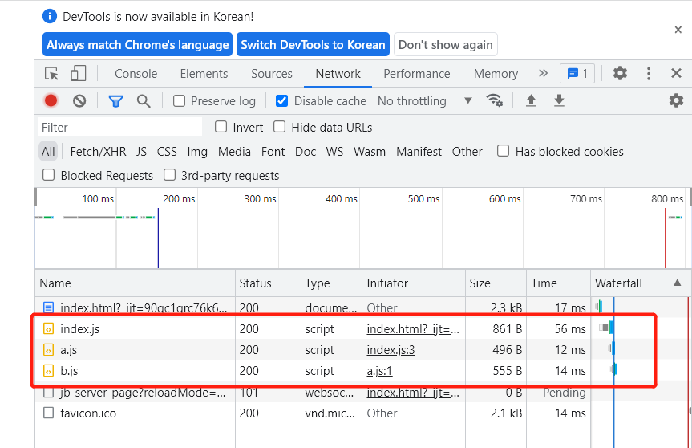
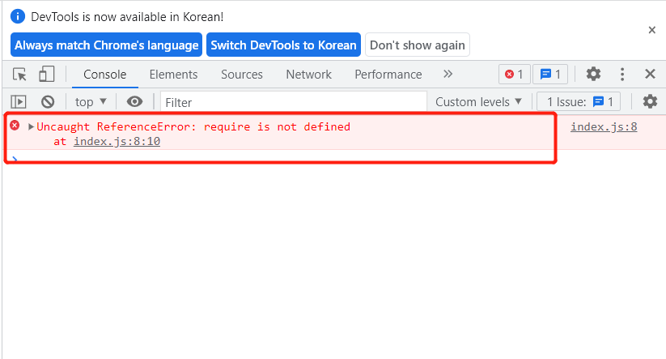
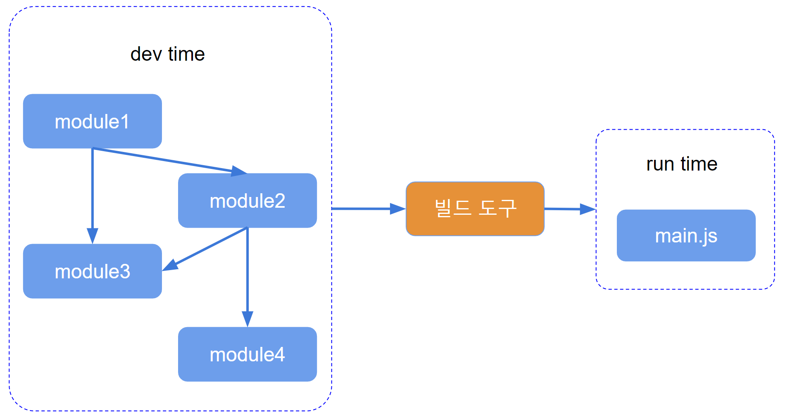

# 브라우저 환경에서의 모듈화 {ignore}

[toc]

## 필요한 사전 지식

webpack 의해를 위한 사전 지식 필요：ES6, [모듈](https://beomy.github.io/tech/javascript/cjs-amd-umd-esm/), 패키지 매니저(npm, yarn), git

## 브라우저 측에서의 모듈화 실현

문제점：

- 효울 문제：세분화된 모듈 구분은 많은 양의 JS파일을 생성하게 하고 파일이 많아질 수록 요청이 많아져 페이지 액세스 효율성 감소([3-Way Handshake & 4-Way Handshake](https://velog.io/@averycode/%EB%84%A4%ED%8A%B8%EC%9B%8C%ED%81%AC-TCPUDP%EC%99%80-3-Way-Handshake4-Way-Handshake))

  ```js
        // b.js
       export default "b";


        // a.js
       import b from "./b.js"
       export default "a";


        // index.js
       import a from "./a.js"
  ```

  ```html
  <!-- index.html -->
  ...
  <script src="./modules/index.js" type="module"></script>
  ...
  ```

  

- 호환성 문제：현재 브라우저는 ES6 모듈 패턴만 지원, 호환성 문제가 존재함 ([브라우저 환경 및 노드 환경에서 동시에 사용하는 라이브러리 개발](https://github.com/axios/axios/tree/v1.x/dist))

  ```js
  // index.js
  var fs = require("fs"); //노드에서 제공하는 fs，파일 처리할때 많이 사용
  var path = require("path");
  var abPath = path.resolve(__dirname, "./test.txt");

  var content = fs.readFileSync(abPath, {
    encoding: "utf-8",
  });

  console.log(content);

  // 노드 환경에서 실행 -> node index.js
  // output: 이건 txt 문서의 내용임

  // 브라우저 환경에서 실행 -> Open With Live Server
  // output: index.js:8 Uncaught ReferenceError: require is not defined at index.js:8:10
  ```

  

- 툴 문제：브라우저 환경에서는 npm으로 다운로드한 라이브러리 사용하지 못함

  ```shell
    npm i jquery
  ```

  ```js
  // index.js

  // 노드 환경에서 실행 -> node index.js
  const $ = require("jquery");
  console.log($); // output: [Function (anonymous)]

  // 브라우저 환경에서 실행 -> Open With Live Server
  import $ from "jquery";
  console.log($); // output: [Function (anonymous)]
  // output: Uncaught TypeError: Failed to resolve module specifier "jquery". Relative references must start with either "/", "./", or "../".

  import $ from "../node_modules/jquery/dist/jquery.js";
  console.log($);
  //index.js:21 Uncaught SyntaxError: The requested module '../node_modules/jquery/dist/jquery.js' does not provide an export named 'default' (at index.js:21:8)
  ```

이 외에도 기타 문제점:
실행 효율, 코드의 유지보수성 확장성, 팀 워크, 테스트 등등.

이러한 문제들은 모두 모듈화 관련된 문제이고 제품 개발과는 상관 없지만 제품 개발 속도에 엄청난 영향을 미치며
마땅한 툴이 존재하지 않는 경우 우리의 개발 속도가 느려질뿐만 아니라 개발 부채도 늘어날 수 있다.

## 근본적인 원인

생각해야 할 문제: 위에서 언급한 문제가 노드 측에서는 그다지 심각하지 않은데 브라우저 측에서 심각해지는 이유는 무엇일까?

답: 노드 측에서는 실행 중인 JS 파일이 로컬에 있으므로 파일을 로컬에서 읽을 수 있으므로 브라우저에서 원격으로 파일을 전송하는 것보다 훨씬 효율적이다.

**근본적 원인**：브라우저 측면에서 dev time과 run time은 서로 다른 초점을 갖는다.

**dev time：**

1. 모듈의 분할이 세밀할수록 좋다.
2. 여러 모듈 표준 지원
3. npm 또는 다른 패키지 관리자가 다운로드 한 모듈 지원
4. 호환성 고민없이 코드 작성

**run time:**

1. 파일 수가 적을수록 좋다.
2. 파일 크기가 작을수록 좋다.
3. 코드 내용이 지저분할수록 좋다.
4. 모든 브라우저와 호환 가능
5. 다른 런타임 문제, 주로 실행 효율성을 해결할 수있는 능력

이 차이는 소규모 프로젝트에서는 분명하지 않지만 프로젝트가 확장되면 점점 더 분명 해지고 이러한 문제가 해결되지 않으면 프런트 엔드 프로젝트가 규모 확장이 어려움.

## 해결 방법

dev time과 run time이 직면한 상황은 크게 다르기 때문에 개발자가 dev time에서 코드를 작성하는 데 집중할 수 있는 도구가 필요하고,
그 도구를 사용하여 dev time으로 작성된 코드를 run time에 필요한 것으로 변환할 수 있어야 함.

이러한 도구를 **빌드 도구**라고 함.



이를 통해 개발자는 run time 관련 문제에 대해 걱정할 필요 없이 코드 구조 개발에만 집중할 수 있다.

## 자주쓰는 빌드 도구

- **webpack**
- vite
- parcel
- rollup
- grunt
- gulp
- browserify
- fis
- 기타
