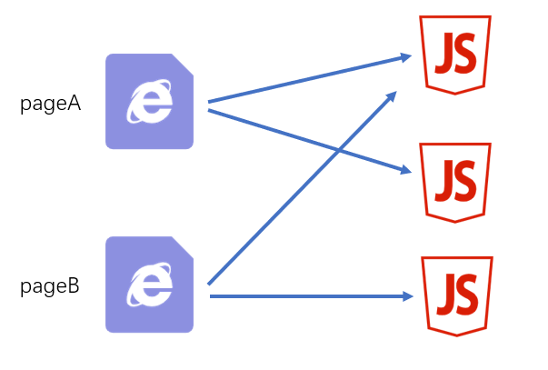

# entry와 output 설정의 모범사례 {ignore}

상황별 분석

다음은 몇 가지 대표적인 시나리오입니다.

## 한개 페이지에 한개 JS


파일 구조

```
|—— src
    |—— pageA   페이지A의 폴더
        |—— index.js 페이지A의 스타트 모듈
        |—— ...
    |—— pageB   페이지B의 폴더
        |—— index.js 페이지B의 스타트 모듈
        |—— ...
    |—— pageC   페이지C의 폴더
        |—— main1.js 페이지C의 스타트 모듈1 예: 메인 기능
        |—— main2.js 페이지C의 스타트 모듈2 예: 방문자 기록하는 기능
        |—— ...
    |—— common  공용 코드 폴더
        |—— ...
```

webpack 설정

```js
module.exports = {
  entry: {
    pageA: "./src/pageA/index.js",
    pageB: "./src/pageB/index.js",
    pageC: ["./src/pageC/main1.js", "./src/pageC/main2.js"],
  },
  output: {
    filename: "[name].[chunkhash:5].js",
  },
};


/**
 *   output files
 *   |—— pageA.1cbfe.js
 *   |—— pageB.bcfca.js
 *   |—— pageC.14469.js
 *
 * /
```

이런 방식은 페이지 간에 기능이 크게 다르고 공통 코드가 거의 없는 경우에 적합하며, 이 경우 최종 패키지에 중복 코드가 많지 않습니다.

## 한개 페이지에 여러 개의 JS



파일 구조

```
|—— src
    |—— pageA   페이지A의 폴더
        |—— index.js 페이지A의 스타트 모듈
        |—— ...
    |—— pageB   페이지B의 폴더
        |—— index.js 페이지B의 스타트 모듈
        |—— ...
    |—— statistics   방문자 수 기록을 위한 함수 폴더
        |—— index.js 스타트 모듈
        |—— ...
    |—— common  공용 코드 폴더
        |—— ...
```

webpack 설정

```js
module.exports = {
  entry: {
    pageA: "./src/pageA/index.js",
    pageB: "./src/pageB/index.js",
    statistics: "./src/statistics/index.js",
  },
  output: {
    filename: "[name].[chunkhash:5].js",
  },
};

/**
 *   output files
 *   |—— pageA.1cbfe.js
 *   |—— pageB.bcfca.js
 *   |—— statistics.cb84c.js
 *
 * /
```

이 방식은 페이지 간에 **독립적**이면서 동일한 기능이 있고 이 JS를 추출하기 위해 특별히 chunk를 사용하면 브라우저가 이 내용을 더 잘 캐싱하는 데 도움이 되는 경우에 적합합니다.

> 고민: 다중 페이지 다중 chunk 방식을 사용하지 않을까요?

## SPA

단일 페이지 애플리케이션은 단일 페이지로 구성된 웹사이트로, 페이지가 전적으로 JS에 의해 생성되고 제어됩니다. vue와 react는 모두 단일 페이지 애플리케이션을 구현하는 데 훌륭한 도구입니다.


파일 구조

```
|—— src
    |—— subFunc   자식 기능 폴더
        |—— ...
    |—— subFunc   자식 기능 폴더
        |—— ...
    |—— common   공용 코드 폴더
        |—— ...
    |—— index.js
```

webpack 설정

```js
module.exports = {
  entry: "./src/index.js",
  output: {
    filename: "index.[hash:5].js",
  },
};

/**
 *   output files
 *   |—— index.80b32.js
 *
 * /
```
