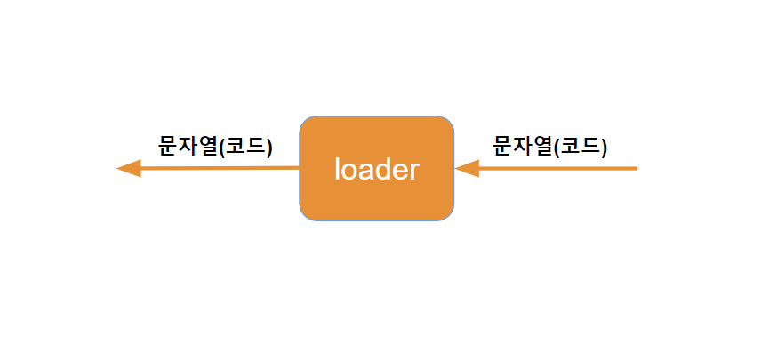
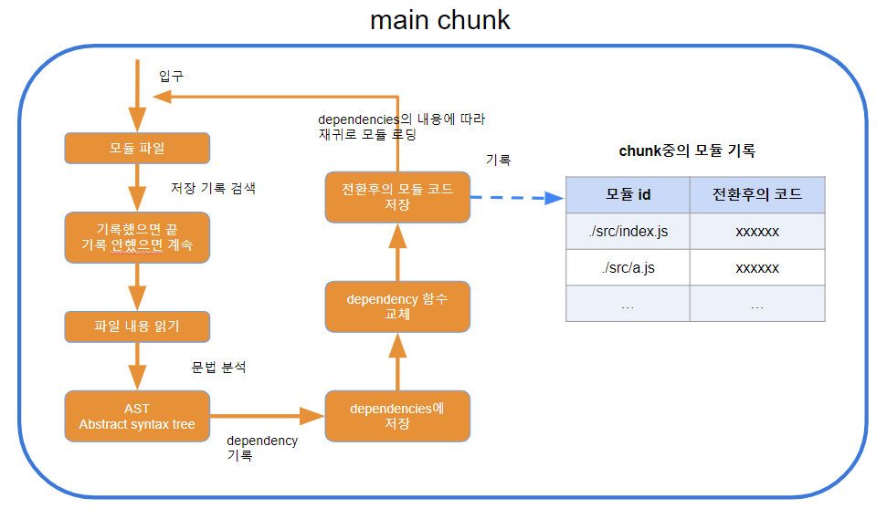
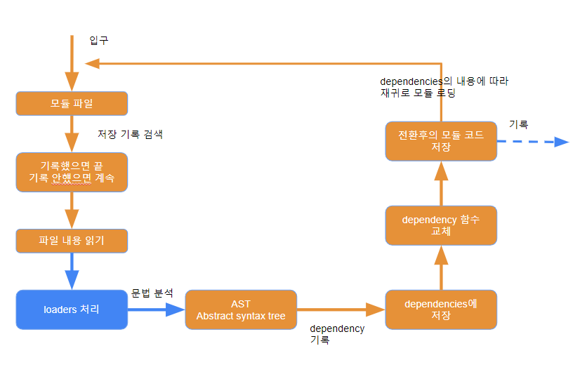
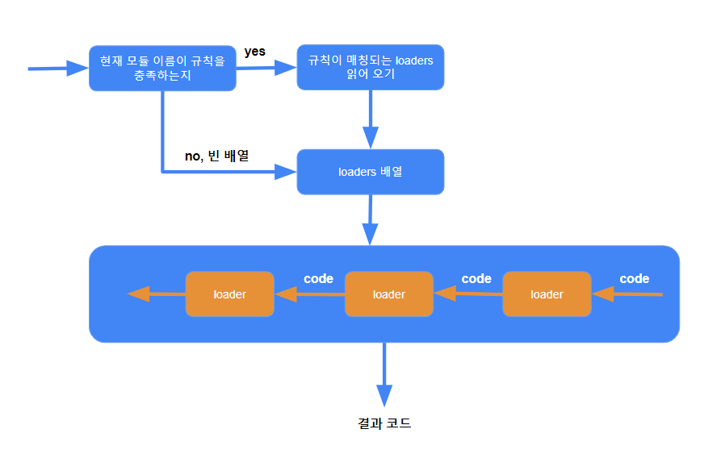

# loader

> webpack이 하는 일은 단순히 다양한 모듈의 종속성을 분석하고 리소스 목록을 구성한 후 지정된 파일로 패키징하는 것입니다.
> 더 많은 기능은 webpack loader와 webpack plugin의 도움으로 수행됩니다.

webpack loader： loader는 기본적으로 소스 코드 문자열을 다른 소스 코드 문자열로 변환하여 반환하는 함수입니다.



loader 함수는 모듈을 분석하는 프로세스 중에 호출되어 최종 소스 코드를 얻습니다.

**전체 프로세스：**


**chunk 중 모듈을 분석하는 프로세스：**



**chunk 중 모듈을 분석하는 더 자세한 프로세스：**



**loaders 처리 프로세스：**



**loaders 처리 순서：**

> loader rules, use 배열 역순으로 처리됩니다.

```js
/**
 *  파일 구조
 *  |—— src
 *     |—— a.js
 *     |—— index.js // require("./a");
 */

module.exports = {
  mode: "development",
  module: {
    rules: [
      {
        test: /index\.js$/,
        use: ["./loaders/loader1", "./loaders/loader2"],
      }, //rule1
      {
        test: /\.js$/,
        use: ["./loaders/loader3", "./loaders/loader4"],
      }, ///rule2
    ],
  },
};

// 결과
// loader4실행 (src\index.js)
// loader3실행 (src\index.js)
// loader2실행 (src\index.js)
// loader1실행 (src\index.js)
// loader4실행 (src\a.js)
// loader3실행 (src\a.js)
```

**loader 설정：**

**자세한 설정**

```js
module.exports = {
  module: {
    // 모듈 구성의 경우, v4 버전에는 rules, noParse 이 두 가지 구성만 있습니다.
    // v5 버전에는 generator, parser 구성도 있습니다.
    rules: [
      //모듈 매칭 규칙, 여러 규칙이 존재할 수 있습니다.
      {
        // 각 규칙은 객체입니다.
        test: /\.js$/, // 모듈 매칭 정규식
        use: [
          //매칭한 후 적용되는 loaders
          {
            //그 중 하나의 loader
            loader: "loader경로", //loader 모듈의 경로, 해당 문자열은 require에서 사용됨
            options: {
              // 해당 loader에 전달되는 추가 매개변수
            },
          },
        ],
      },
    ],
  },
};
```

**간단한 설정**

```js
module.exports = {
  module: {
    rules: [
      {
        test: /\.js$/,
        use: ["loader경로1", "loader경로2"],
      },
    ],
  },
};
```
