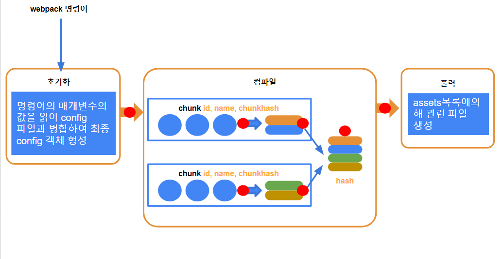
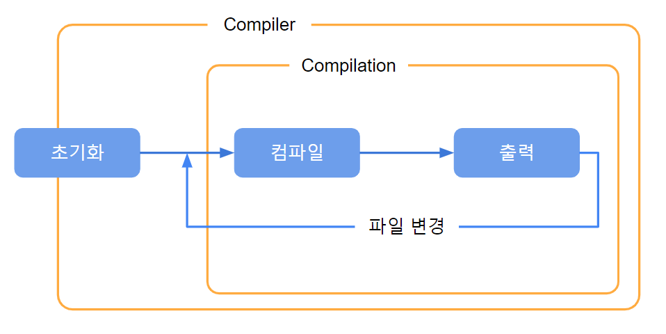

# plugin

loader의 기능은 코드를 변환하는것 이지만 일부 작업은 loader를 사용하여 수행하기 어렵습니다. 예를 들어:

- webpack이 파일을 생성할 때 추가 설명 파일도 함께 생성해야될 때.
- webpack 컴파일이 시작되면 콘솔은 webpack이 시작되었음을 나타내는 문장을 출력해야될 때.
- xxxx, xxxx

이러한 종류의 기능은 webpack 빌드 프로세스중 실행되어야 하며, 이는 플러그인에 의존하여 달성됩니다.



plugin의 **본질**은 apply 메서드가 있는 객체입니다.

```js
var plugin = {
  apply: function (compiler) {},
};
```

일반적으로 객체를 Class로 작성합니다.

```js
class MyPlugin {
  apply(compiler) {}
}

var plugin = new MyPlugin();
```

webpack에 플러그인을 적용시키려면 다음과 같이 플러그인 객체를 webpack의 plugins 배열에 설정해야 합니다.
plugin 실행 시점은 이벤트 발생 시각이므로 등록 순서와는 상관이 없지만 동일한 plugin을 등록했을 경우 배열의 index 순서대로 실행됩니다.

예를 들어:

```js
module.exports = {
  plugins: [new MyPlugin("one"), new MyPlugin("two")],
};

// new MyPlugin("one") 먼저 실행
// new MyPlugin("two") 후에 실행
```

apply 함수는 초기화 단계에서 Compiler 객체가 생성된 후 실행됩니다.

compiler 객체는 초기화 단계에서 생성되며, 전체 webpack 패키징 기간 동안 compiler 객체는 하나만 존재하고 패키징 작업을 실행하는 것은 compiler 객체 내부에서 생성된 compilation 입니다.

apply 메서드는 **compiler 객체가 생성된 후에 호출되며**, compiler 객체가 메서드에 전달됩니다.



compiler 객체는 플러그인 개발자가 webpack 컴파일 및 생성에 참여하기 위해 등록할 수 있는 여러 hooks(이벤트로 이해할 수 있음)를 제공합니다.

다음 코드를 apply 메서드에 훅을 등록할 수 있습니다:

```js
class MyPlugin {
  apply(compiler) {
    compiler.hooks.이벤트이름.이벤트타입(name, function (compilation) {
      //이벤트 처리 함수
    });
  }
}
```

**이벤트 이름**

문서：https://webpack.js.org/api/compiler-hooks

**이벤트 타입**

이 부분은 [Tapable API](https://github.com/webpack/tapable) 사용하고 있으며 이는 hook 함수 리스너 전용 라이브러리입니다.

제공하는 이벤트 타입:

- tap: 콜백 함수가 호출 및 실행 완료되면 이벤트 처리의 끝임을 알리는 동기식 hook을 등록합니다.
- tapAsync: 콜백을 호출하면 이벤트 처리의 끝임을 알리는 비동기 콜백 기반 hook을 등록합니다.
- tapPromise: Promise를 반환하여 resolve 상태로 이벤트 처리의 끝임을 알리는 Promise 기반 비동기 hook을 등록합니다.

**함수 실행**

함수 실행할때 하나의 매개변수를 받음`compilation`
