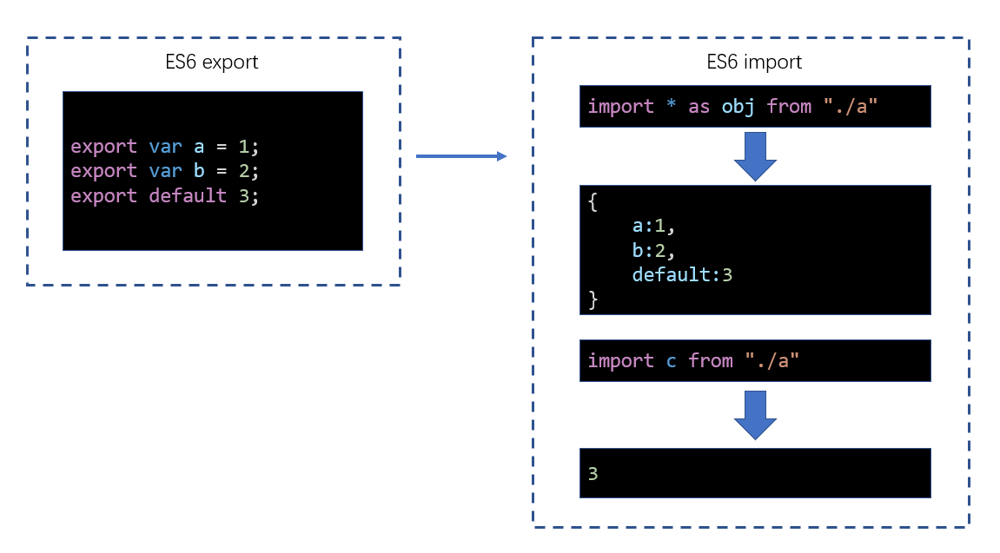

# 모듈화 호환성

webpack은 CommonJS와 ES6 모듈을 모두 지원하므로 웹팩이 상호 운용성을 처리하는 방식을 이해하는 것이 중요하다.

## 동일한 모듈 표준

동일한 모듈 표준을 사용하여 내보내고 가져오는 경우, 패키지 결과는 이전에 배운 모듈성과 다르지 않다.

## 다양한 모듈 표준

webpack은 다음과 같은 방식으로 다양한 모듈 표준을 처리한다.

## 모범 사례

코드 작성에서 피해야 할 가장 중요한 것은 정신분열증이다. 적절한 모듈성 표준을 선택한 다음 개발 단계 전체에 걸쳐 구현해야 한다.
