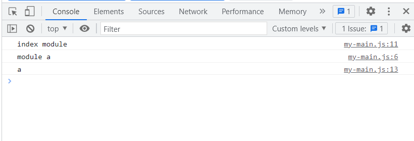
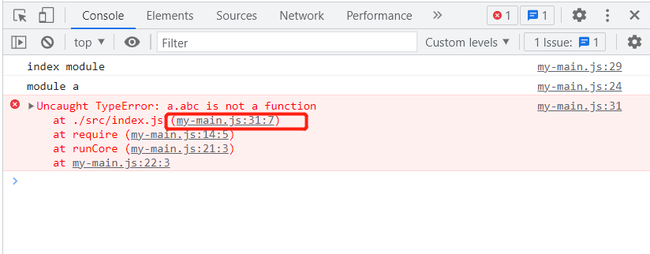
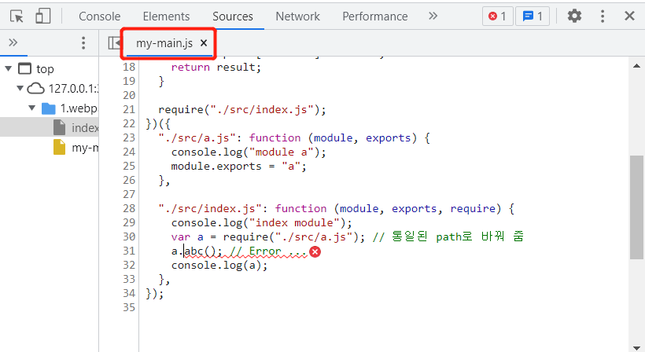
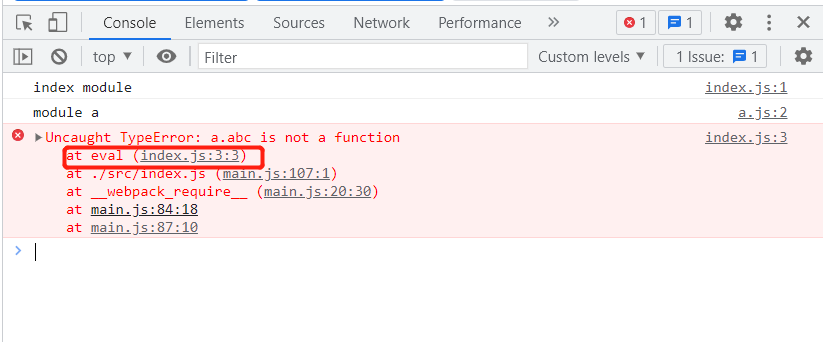
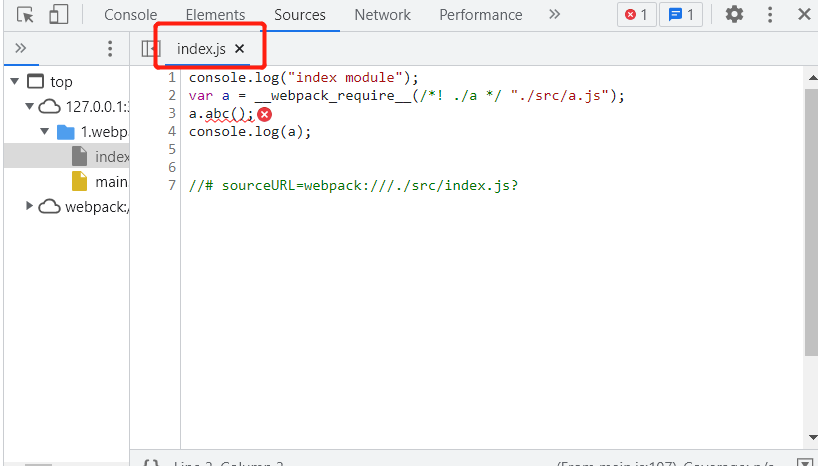

# webpack complie 결과 분석

## Core 간단 실현

```js
// ./src/index.js
console.log("index module");
var a = require("./a");
console.log(a);

// ./src/a.js
console.log("module a");
module.exports = "a";
```

src 폴더에 위와 같이 두개의 파일을 생성하고 webpack으로 패키징한다고 가정했을 경우 아래와 같은 결과 파일이 생성된다.
**해당 코드는 간소화한 것으로 실제 webpack 코드가 이렇게 되어있지 않지만 대략 원리가 이러하다는 점 인지하길**

```js
// 두개의 모듈 merge

// 해당 객체는 모든 모듈 및 모듈내 코드를 저장하는 용도
var modules = {
  "./src/a.js": function (module, exports) {
    console.log("module a");
    module.exports = "a";
  },

  "./src/index.js": function (module, exports, require) {
    console.log("index module");
    var a = require("./src/a.js"); // 통일된 path로 바꿔 줌
    console.log(a);
  },
};

var runCore = (modules) => {
  // 모듈 캐시
  var moduleExports = {};

  // require함수 실행은 해당 모듈을 실행하고 export하는 결과물을 얻어내는 것과 같다고 보면 됨
  // entry js파일 실행을 위해 require함수 기능 구현
  function require(moduleId) {
    // 캐시에서 먼저 찾기
    if (moduleExports[moduleId]) {
      return moduleExports[moduleId];
    }

    // moduleId 는 modules의 key 값
    var func = modules[moduleId]; // 해당 모듈의 함수
    var module = {
      exports: {},
    };

    func(module, module.exports, require); //해당 함수 실행 완료후 각 모듈에서 export하는 값은 module.exports에 저장됨

    // module.exports에 저장된 값을 캐시에 저장 하고 해당 값은 return 함
    var result = module.exports;
    moduleExports[moduleId] = result;
    return result;
  }

  // entry js파일 실행
  require("./src/index.js");
};

runCore(modules);
```

위와 같이 수동으로 만든 my-main.js를 html에서 import 해보면 아래와 같이 잘 병합됐음을 알 수 있다


하지만 위와 같이 `var modules = {...}` 이런 식으로 변수 혹은 함수 선언하면 전역 변수 오염문제가 생길 수 있기에 webpack에서는 선 실행함수로 처리 하고 있음

```js
(function runCore(modules) {
  var moduleExports = {};

  function require(moduleId) {
    if (moduleExports[moduleId]) {
      return moduleExports[moduleId];
    }

    var func = modules[moduleId];
    var module = {
      exports: {},
    };

    func(module, module.exports, require);

    var result = module.exports;
    moduleExports[moduleId] = result;
    return result;
  }

  require("./src/index.js");
})({
  "./src/a.js": function (module, exports) {
    console.log("module a");
    module.exports = "a";
  },

  "./src/index.js": function (module, exports, require) {
    console.log("index module");
    var a = require("./src/a.js");
    console.log(a);
  },
});
```

`npx webpack --mode=development` 실행하여 webpack에서 패키징 결과를 보다 보면 아래와 같은 코드를 볼 수 있다

```js
"./src/a.js": function (module, exports) {
    eval(
      '\r\nconsole.log("module a")\r\nmodule.exports = "a";\n\n//# sourceURL=webpack:///./src/a.js?'
    );
  }
```

eval는 MDN 공식 문서에서 해킹 위험으로 쓰지 말라고 권장하고 있지만 여기서는 왜쓸까?
이는 webpack은 우리가 썼던 코드들을 모두 main.js에 병합해주는데 이렇게 하다 보면 개발 단계에서 디버깅하기 굉장히 어려워지는 단점이 있기 때문이다

```js
//index.js
console.log("index module");
var a = require("./a"); // a는 string "a" 이다
a.abc(); // Error ...
console.log(a);
```




위와 같이 디버깅을 하기 위해 에러 위치를 확인하면 webpack이 만들어준 main.js로 이동하게 되고 이는 우리가 평소 코딩한 코드가 아니기에 분석하기 굉장이 불편함을 느낄수 있다. 하여 디버깅을 더 편리하게 해주기 위해 webpack에서는 개발 모드일때 한정으로 `eval`를 사용하여 우리가 썼던 소스코드로 매핑시켜주는 기능을 제공하고 있다.


