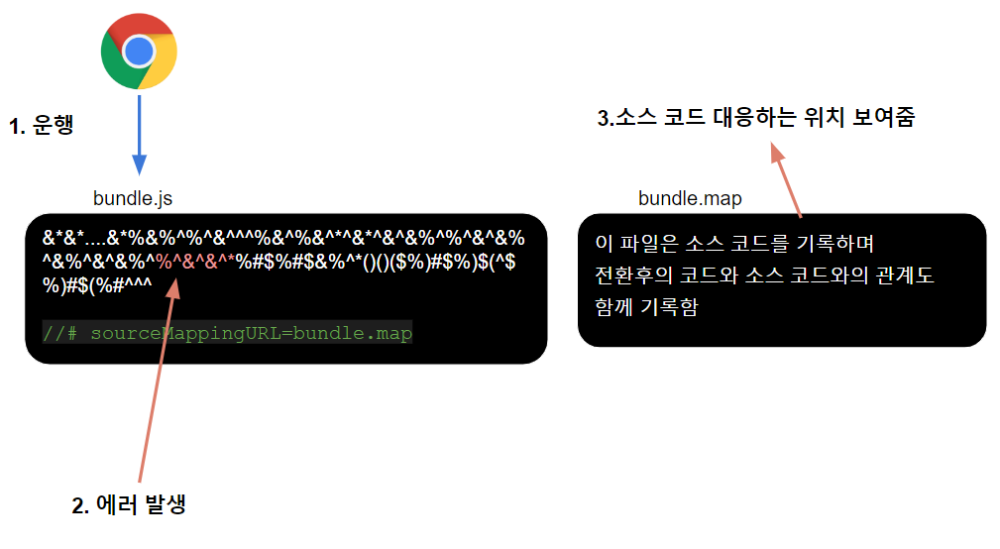

# devtool 구성 {ignore}

[toc]

## source map 소스 코드 맵

> 이 섹션의 지식은 웹팩과 관련이 없습니다.

현재 프론트엔드 개발 트랜드는 소스 코드를 직접 실행하지 않고 병합, 압축, 변환 등의 작업을 거쳐서 실행해야 하는 경우가 많으며, 실제로 실행되는 것은 변환된 코드입니다.

이는 개발자가 디버깅할때 굉장한 어려움을 줍니다. 런타임 오류가 발생하면 변환된 코드가 아닌 소스 코드에서 오류를 확인하는 것을 선호하는데 말입니다.

> jquery 압축후의 코드：https://code.jquery.com/jquery-3.4.1.min.js

이 문제를 해결하기 위해 크롬이 최초로 source map을 지원했으며, 다른 브라우저들도 이를 따라 거의 모든 새로운 브라우저에서 source map을 지원하고 있습니다.

source map은 사실상 한가지 구성이며 이는 모든 소스 코드 내용뿐만 아니라 변환된 코드에 대한 상대 관계도 기록합니다.
브라우저에서 source map을 처리하는 방법은 다음과 같습니다.

**모범 사례**：

1. source map은 개발 환경에서 디버깅 수단으로 사용해야 합니다.
2. source map은 일반적으로 대용량 파일로 추가적인 네트워크 전송을 유발할 뿐만 아니라 원본 코드가 노출될 수 있으므로 프로덕션 환경에서는 사용해서는 안 됩니다. 실제 코드 실행 문제를 디버깅하기 위해 프로덕션 환경에서 source map을 사용해야 하는 경우에도 네트워크 전송 및 코드 노출 문제를 피할 수 있는 조치를 해야합니다.

## webpack 중의 source map

웹팩으로 컴파일된 코드는 디버깅하기 어려우므로 devtool을 사용하여 **디버깅 환경을 최적화**하도록 구성할 수 있습니다.

구체적인 구성에 대해서는 설명서를 참조하세요.：https://www.webpackjs.com/configuration/devtool/
