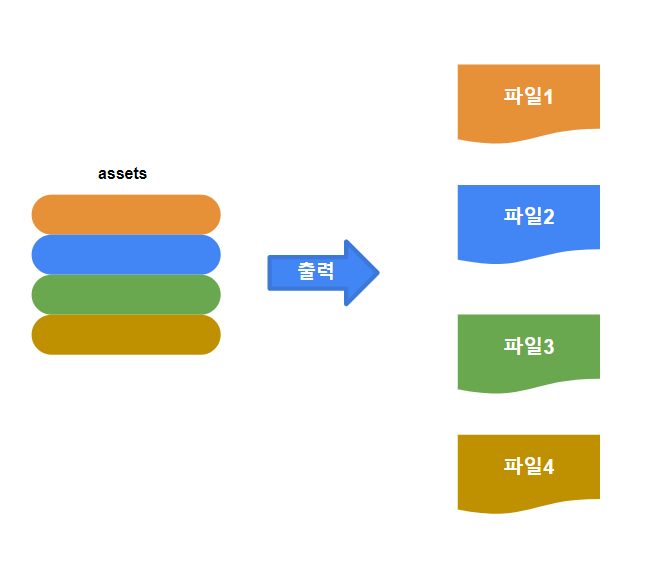

# webpack 컴파일 과정 {ignore}

[toc]

webpack 의 작용은 소스 코드를 최종코드로 컴파일(빌드, 패키징)하는것 입니다.

프로세스는 크게 세 단계로 나뉩니다.

1. 초기화
2. 컴파일
3. 출력

## 초기화

이 단계에서 웹팩은 **CLI 파라미터**, **구성 파일**, **기본 구성**을 융합하여 최종 구성 객체를 형성합니다.

구성 처리는 `yargs`라는 타사 라이브러리에 의존합니다.

이 단계는 비교적 간단하며 주로 다음에 이어지는 컴파일 단계에서 필요한 준비를 합니다.

현재로서는 초기화 단계가 주로 최종 config 파일을 생성하는 데 사용된다고 이해하면 됩니다.

## 컴파일

1. **chunk 생성**

chunk는 webpack 내부 빌드 프로세스에서 entry 파일을 통해 발견되는 모든 의존성을 통칭하는 용어입니다.

chunk는 entry 모듈을 기반으로 생성됩니다.
(default로 `. /src/index.js`)를 기반으로 chunk를 생성합니다.

각 chunk에는 최소 두 가지 속성이 있습니다:

- name: 기본값은 main
- id: 개발 환경의 경우 이름과 동일한 고유 번호, 프로덕션 환경의 경우 0으로 시작하는 번호입니다.

2. **모든 종속 모듈 빌드하기**

> AST online test 도구：https://astexplorer.net/

스케치 맵

3. **chunk assets 생성**

두 번째 단계가 완료되면 **모듈 ID**와 **모듈 변환 코드**가 포함된 chunk에 모듈 목록이 생성됩니다.

그 다음 webpack은 설정에 따라 chunk에 대한 리소스 목록인 'chunk assets'을 생성하며, 이는 최종 파일로 생성된 파일의 파일명과 내용이라고 해석할 수 있습니다.

> chunk hash는 모든 chunk assets의 내용으로부터 생성된 hash 문자열입니다.
> hash: 다양한 분류가 있는 알고리즘으로, 임의 길이의 문자열을 고정 길이의 문자열로 변환하고 원본 내용이 변경되지 않으면 결과 해시 문자열도 변경되지 않도록 보장합니다.

스케치 맵

4. **chunk assets 병합**

여러 chunk의 assets을 병합하고 총 해시를 생성합니다.

## 출력

이 단계는 매우 간단합니다. webpack은 노드의 fs 모듈(파일 처리 모듈)을 사용하여 컴파일에서 생성된 총 assets을 기반으로 상응하는 파일을 생성합니다.

## 총 과정

**관련 단어**

1. module: 모듈은 코드의 분할 단위. webpack의 모듈은 JS뿐만 아니라 임의의 내용이 포함된 파일이 될 수 있습니다.
2. chunk: 모듈을 빌드하는 웹팩 내의 덩어리. chunk에는 의존성 분석을 통해 entry 모듈에서 파생된 여러 모듈이 포함됩니다.
3. bundle: chunk가 빌드된 후 chunk에 있는 리소스 목록이 생성되며, 목록의 각 항목이 번들이므로 번들을 최종 파일로 생각하면 됩니다.
4. hash: 최종 리소스 목록의 모든 내용을 합쳐서 생성된 해시 값입니다.
5. chunkhash: chunk가 생성한 리소스 목록의 내용들이 공동으로 생성한 해시 값입니다.
6. chunkname: chunk의 이름(기본값 main)
7. id: chunk의 고유 번호(개발 환경에서 빌드된 경우 일반적으로 chunk 이름과 동일), 프로덕션 환경에서 빌드된 경우 0으로 시작하는 숫자
